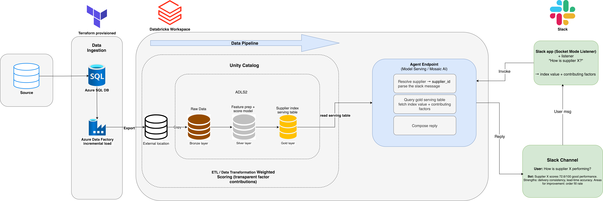
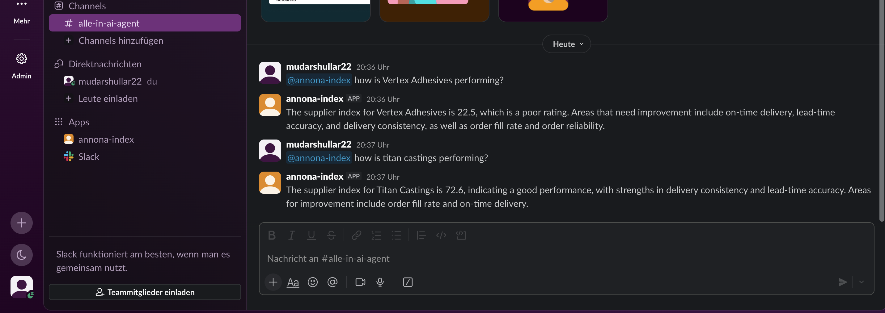

# annona-index

## Overview
Supplier purchase order data lands in Azure SQL DB, is ingested into Databricks via Data Factory, and flows through a bronze, silver and gold medallion pipeline in unity catalog. The gold layer holds a supplier performance index (0-100) per supplier, computed with a weighted scorecard.

An AI agent (Databricks model serving) sits on top of the gold table. It identifies a supplier from a question, looks up the index and its contributing factors, and replies in plain language. A slack bot connects the agent to a channel, so anyone can ask about a supplier and get an instant answer.

A full breakdown of the stepup and the connection to slack will be explained later.

## Solution Architecture

## Example from slack

